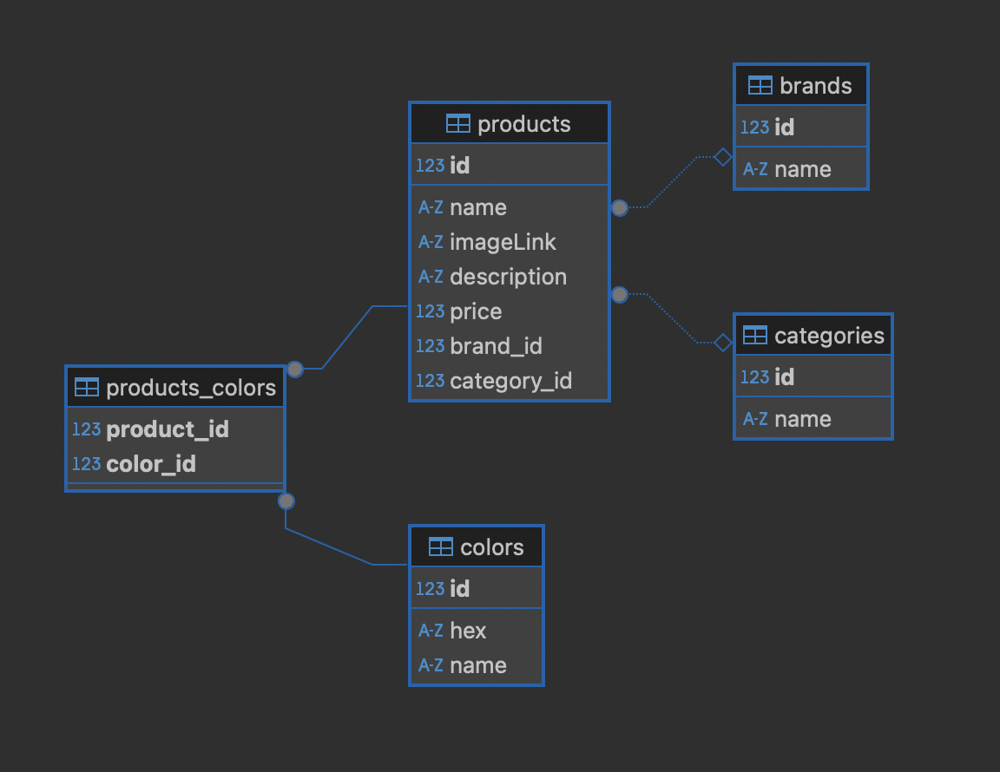

# Projet

*  🔖 **MCD**
*  🔖 **Fixtures**
*  🔖 **Pratique**

___

## 📑 MCD

Pour aller plus loins et manipuler les données nous allons utiliser le MCD suivant.



Pour pouvoir manipuler le schema de données nous utiliserons [Doctrine](https://www.doctrine-project.org/) et les entitées situées dans le dossier `src/Entity/` simplifié avec les commandes suivantes:

Créer la base de données:

```bash
composer db:create
```

Supprimer la base de données:

```bash
composer db:drop
```

Mettre à jour la base de données:

```bash
composer db:update
```

Quand vous modifiez une entité vous pouvez mettre à jour le schema de données avec la commande fournie.

___

## 📑  Fixtures

Nous travaillons avec des données qui sont seedées.

Pour seeder les données, vous pouvez utiliser la commande suivante:

```bash
composer migrate
```


___

## 👨🏻‍💻 Pratique


- Créer un fichier qui s'exécute à l'installation et qui appel votre création d'indice réalisé précédement.
- Créer mapping de l'indice en rapport avec les données exposées doit être spécifié.

