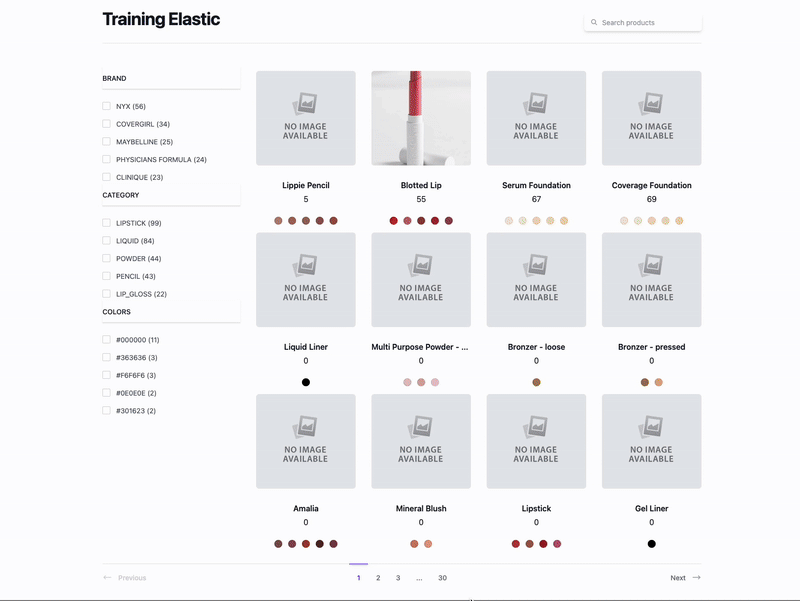

# Document

*  🔖 **Full text query**
*  🔖 **Sort**
*  🔖 **Paginate**
*  🔖 **Pratique**

___

## 📑 Full text query

Une recherche se compose d'une ou plusieurs requêtes combinées et envoyées à Elasticsearch. Les documents correspondant aux requêtes d'une recherche sont renvoyés dans les résultats de la réponse .

https://www.elastic.co/guide/en/elasticsearch/reference/current/search-your-data.html

### 🏷️ **Match**

Renvoie les documents correspondant à un texte, un nombre, une date ou une valeur booléenne fournis. Le texte fourni est analysé avant la correspondance.

https://www.elastic.co/guide/en/elasticsearch/reference/current/query-dsl-match-query.html


Renvoie tous les documents contenant le mot "Lippie" dans le champ name.

```json
"query" : {
    "match" : {
        "name" : "Lippie"
    }
}
```

- Operateur

La matchrequête est de type boolean. Cela signifie que le texte fourni est analysé et que le processus d'analyse construit une requête booléenne à partir de ce texte. Le operatorparamètre peut être défini sur orou and pour contrôler les clauses booléennes (par défaut : or)

```json
{
  "query": {
    "match": {
      "name": {
        "query": "Lippie foo",
        "operator": "or"
      }
    }
  }
}
```

- Fuzziness

Renvoie les documents contenant des termes similaires au terme de recherche, tel que mesuré par une distance d'édition de Levenshtein .

https://www.elastic.co/guide/en/elasticsearch/reference/current/query-dsl-fuzzy-query.html


```json
{
  "query": {
    "match": {
      "name": {
        "query": "Lippppie",
        "fuzziness": "AUTO"
      }
    }
  }
}
```

> ! L'option boost est dépréciée

### 🏷️ **Multi match**

La multi_matchrequête s'appuie sur la matchrequête pour permettre des requêtes multi-champs :

```json
{
  "query": {
    "multi_match" : {
      "query": "Lippie", 
      "fields": [ "name", "description" ] 
    }
  }
}
```

Les champs individuels peuvent être renforcés avec la ^notation caret :

Ex: `name^2`

### 🏷️ **Term**

https://www.elastic.co/guide/en/elasticsearch/reference/current/query-dsl-term-query.html

Renvoie les documents qui contiennent un terme exact dans un champ fourni.

```json
{
  "query": {
    "term": {
      "brand": {
        "value": "nyx",
        "boost": 1.0
      }
    }
  }
}
```

### 🏷️ **Match boolean prefix**

Une match_bool_prefixrequête analyse ses entrées et construit une boolrequête à partir des termes. Chaque terme, sauf le dernier, est utilisé dans une termrequête

```json
{
  "query": {
    "match_bool_prefix" : {
      "name" : "Halo Cream H"
    }
  }
}
```

### 🏷️ **Match phrase**

La match_phraserequête analyse le texte et crée une phraserequête à partir du texte analysé. Par exemple :

https://www.elastic.co/guide/en/elasticsearch/reference/current/query-dsl-match-query-phrase.html

```json
{
  "query": {
    "match_phrase": {
      "description": "Line your lids in holographic"
    }
  }
}
```

Tout comme observé précédement la query Match Phrase est disponible avec le prefix.

### 🏷️ **Combined fields**

La `combined_fields` requête permet de rechercher dans plusieurs champs de texte comme si leur contenu était indexé dans un seul champ combiné.

```json
{
  "query": {
    "combined_fields" : {
      "query": "cream",
      "fields": [ "category", "brand"],
      "operator": "and"
    }
  }
}
```

### 🏷️ **Query string**

Cette requête utilise une syntaxe pour analyser et fractionner la chaîne de requête fournie en fonction d'opérateurs tels que ANDou NOT. La requête analyse ensuite chaque texte fractionné indépendamment avant de renvoyer les documents correspondants.

https://www.elastic.co/guide/en/elasticsearch/reference/current/query-dsl-query-string-query.html

```json
{
  "query": {
    "query_string" : {
      "query": "(cream) OR (gel)",
      "fields": [ "category", "brand"]
      }
  }
}
```

Nous n'observerons pas plus loin les opérateurs de recherche disponibles s'agissant d'une syntaxe alternative à la requête booléenne.

### 🏷️ **Intervals query**

Renvoie les documents en fonction de l'ordre et de la proximité des termes correspondants.

https://www.elastic.co/guide/en/elasticsearch/reference/current/query-dsl-intervals-query.html

```json
{
  "query": {
    "intervals" : {
      "description" : {
        "all_of" : {
          "ordered" : true,
          "intervals" : [
            {
              "match" : {
                "query" : "smooth and",
                "max_gaps" : 0,
                "ordered" : true
              }
            },
            {
              "any_of" : {
                "intervals" : [
                  { "match" : { "query" : "unique sponge" } },
                  { "match" : { "query" : "silky soft" } }
                ]
              }
            }
          ]
        }
      }
    }
  }
}
```

___

## 📑 Sort

https://www.elastic.co/guide/en/elasticsearch/reference/current/sort-search-results.html

On peut évidement trier les résultats.

```json
"sort" : [
  { "name" : "desc" },
  { "age" : "desc" },
  "_score"
],
```

___

## 📑 Paginate

Il y a plusieurs méthodes de pagination disponibles.

https://www.elastic.co/guide/en/elasticsearch/reference/current/paginate-search-results.html

- [From and size pagination](https://www.elastic.co/guide/en/elasticsearch/reference/current/paginate-search-results.html#from-and-size-pagination) : Idéal pour créer une liste de pages dans lesquelles les utilisateurs peuvent naviguer.
- [Search after](https://www.elastic.co/guide/en/elasticsearch/reference/current/paginate-search-results.html#search-after):  : Prend en charge le défilement infini ou permet de charger des résultats supplémentaires avec un bouton « suivant ».
- [Scroll](https://www.elastic.co/guide/en/elasticsearch/reference/current/paginate-search-results.html#scroll-search-results) : Utilisé historiquement pour récupérer tous les documents correspondants. La méthode de recherche avec l' API ponctuelle est désormais recommandée pour une efficacité et une fiabilité accrues.

Nous observerons une pagination from and size.

Cette pagination est très classique mais devient lente sur des gros volumes de données, au dela des 10k documents elle n'est pas conseillée.

```json
{
  "from": 10,
  "size": 10,
  "query": {
    "match": {
      "description": "cream"
    }
  }
}
```

Mais attention au cas ou vous souhaiterz maintenir le résultat de recherche alors que pendant la navigation de page en page les documents sont mis à jour vous devez utiliser le `pit`: [Point of time](https://www.elastic.co/guide/en/elasticsearch/reference/current/point-in-time-api.html)

### 🏷️ **Point of time**

- Créer un pit pour une minute:
- 
```bash
POST products/_pit?keep_alive=1m
```

- Utiliser le pit:

```json
GET _search
{
  "from": 10,
  "size": 10,
  "query": {
    "match": {
      "description": "cream"
    }
  },
      "pit": {
	    "id": "p9S1AwEIcHJvZHVjdHMWWjBRRE9fZlNTbk8yLTltUTZuVjJ4QQAWUTJUdUtvU3BScUd2eHc5Z1NXQ3FSdwAAAAAAAABTuRZobUJHR1c3eFNfNjhVWjAwZU9ZZ3NBAAEWWjBRRE9fZlNTbk8yLTltUTZuVjJ4QQAA", 
	    "keep_alive": "1m"  
    }
}
```

> On observe que le nom de l'indice n'est pas présent dans le endpoint
___

## 👨🏻‍💻 Pratique



- Utiliser l'input de recherche pour effectuer une recherche dans les données indexées.
- Le résultat affiché à l'utilisateur doit contenir des informations qui ne sont pas indexées.
- Le résultat doit être paginé
- Le résultat doit être ordonné par pertinence
