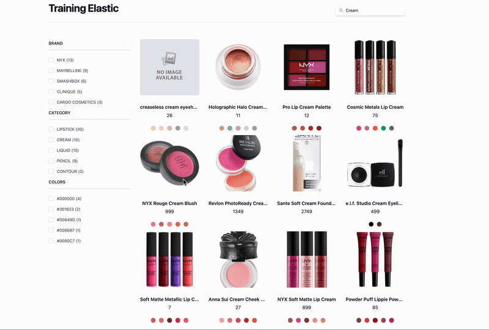

# Aggregations

*  🔖 **Aggregations**
*  🔖 **Filter**
*  🔖 **Pratique**

___

## 📑 Aggregations

https://www.elastic.co/guide/en/elasticsearch/reference/current/search-aggregations.html

Une agrégation synthétise vos données sous forme de métriques, de statistiques ou d'autres analyses.

- Agrégations de mesures qui calculent des mesures, telles qu'une somme ou une moyenne, à partir de valeurs de champ.
- Agrégations de compartiments qui regroupent les documents dans des compartiments, également appelés bacs, en fonction des valeurs de champ, des plages ou d'autres critères.
- Agrégations de pipeline qui prennent des entrées provenant d'autres agrégations au lieu de documents ou de champs.

### 🏷️ **Aggs**

Récupérer les valeurs de champ d'un document.

```json
    "query": {
      "multi_match": {
        "query": "Lip",
        "fuzziness": "AUTO",
        "fields": [
          "name"
        ]
      }
    },
    "aggs": {
      "categories": {
        "terms": {
          "field": "category.keyword"
        }
      }
    }
```

La query renvoie les catégories en rapport avec la query associée

### 🏷️ **Global**

Il est possible de récupérer des valeurs de champ de tous les documents.

```json
    "filters": {
      "global": {}, 
      "aggs": {
        "categories": {
          "terms": {
            "field": "category.keyword",
            "size": 100
          }
        }
      }
    }
```

Dans ce cas il vaut mieux faire une recherche dédiée et la mettre en cache.

### 🏷️ **Cache**

Il est possible de mettre en cache les résultats de la query.

https://www.elastic.co/guide/en/elasticsearch/reference/current/query-cache.html


En spécifiant dans les settings de l'index.

```json
{ 
  "index.requests.cache.enable": true
}
```

https://www.elastic.co/guide/en/elasticsearch/reference/current/shard-request-cache.html#_enabling_and_disabling_caching_per_request

Puis en spécifiant une mise en cache pour une requête.

- Dans le endpoint.

```json
GET /my-index-000001/_search?request_cache=true
```

- Après la query.

```json
  "request_cache": true
```

___


## 📑 Filter

https://www.elastic.co/guide/en/elasticsearch/reference/current/query-filter-context.html

Un filtre répond à la question binaire « Ce document correspond-il à cette clause de requête ? ». La réponse est simplement « oui » ou « non ».

```json
{
  "_source": false, 
  "query": {
    "bool": {
      "must": {
        "multi_match": {
          "query": "Lippie Pencil",
          "fuzziness": "AUTO",
          "fields": ["name"]
        }
      },
      "filter": {
        "term": {
          "filters.category.keyword": "PENCIL"
        }
      }
    }
  }
}
```

### 🏷️ **Contexte**

Les hits ainsi que les aggrégations sont filtrés par le filtre. Ce qui peut poser un problème si vous souhaitez proposer les catégories disponibles sur un motif de recherche: en filtrant sur cette catégories vous n'en proposerez pas d'autres.

C'est contournable avec que l'on a observé précédemment. On peut demander un contexte global à l'aggregation et refaire une requête pour obtenir les catégories disponibles.

```json
{
  "_source": false, 
  "query": {
    "bool": {
      "must": {
        "multi_match": {
          "query": "Lippie Pencil",
          "fuzziness": "AUTO",
          "fields": ["name"]
        }
      },
      "filter": {
        "term": {
          "filters.category.keyword": "PENCIL"
        }
      }
    }
  },
  "aggs": {
    "filters_categories": {
     "global": {},
     "aggs": {
       "matching_categories": {
          "filter": {
              "multi_match": {
              "query": "Lippie Pencil",
              "fuzziness": "AUTO",
              "fields": ["name"]
            }
          },
          "aggs": {
            "filters.categories": {
              "terms": {
                "field": "filters.category.keyword"
              }
            }
          }
       }
     }
    },
    "all_categories": {
      "global": {}, 
      "aggs": {
        "categories": {
          "terms": {
            "field": "filters.category.keyword",
            "size": 1000
          }
        }
      }
    }
  }
}
```

### 🏷️ **Post filter**

https://www.elastic.co/guide/en/elasticsearch/reference/current/filter-search-results.html

Ce filtre s'applique après la requête et permet de filtrer les résultats de la requête en dehors de l'aggrégation.

```json
"post_filter": {
  "term": {
    "filters.category.keyword": "PENCIL"
  }
},
```


___

## 📑 Pratique




- Afficher un menu de filtre avec:
  - les filtres de catégories
  - les filtres de couleurs
  - les filtres de brands
- Le menu doit contenir tous les filtres disponibles.
- Chaque filtre doit afficher le nombre de résultats concerné par la query en cours
- L'utilisation des filtres doit être croisé et dynamique
